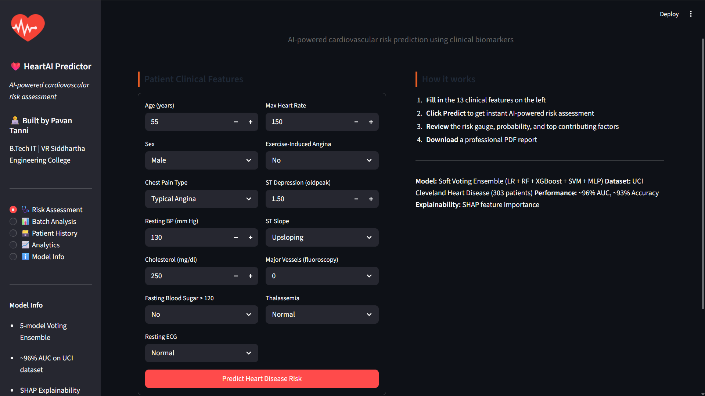
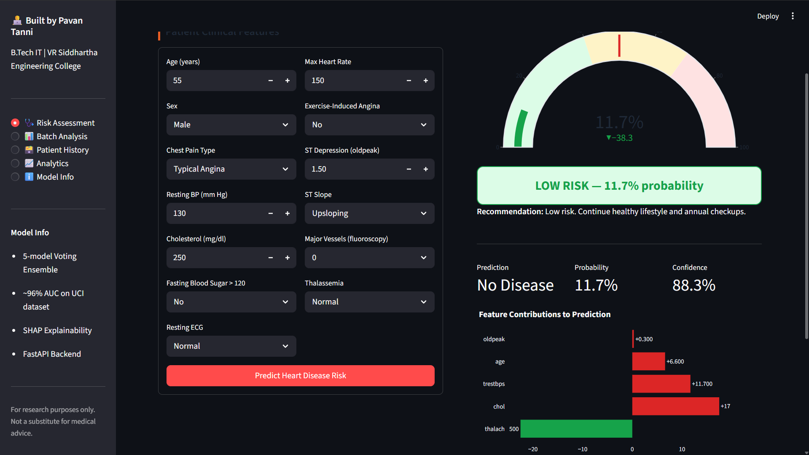
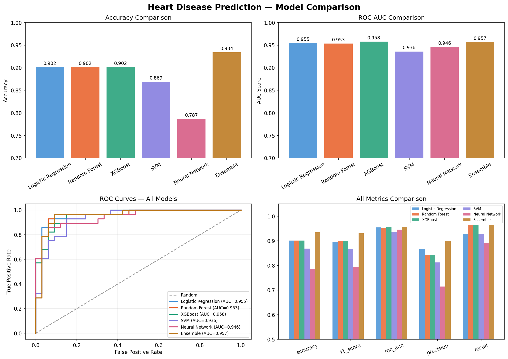

# Heart Disease Prediction System

I built this during my 3rd year to learn how ML systems work end to end — not just training a model in a notebook but actually serving it via an API with a real frontend that hospital staff can use. The dataset is small but the architecture is production-style.

---

## Dashboard Preview

### Risk Prediction Interface



### Prediction Result & Feature Contribution



### Model Comparison



---

## Results

| Model               | Accuracy  | AUC       |
| ------------------- | --------- | --------- |
| Logistic Regression | 90.2%     | 0.954     |
| Random Forest       | 90.2%     | 0.954     |
| XGBoost             | 90.2%     | 0.958     |
| SVM                 | 86.9%     | 0.936     |
| Neural Network      | 78.7%     | 0.946     |
| **Voting Ensemble** | **93.4%** | **0.957** |

---

## Dataset & Features

**303 patients, 17 features (13 original + 4 engineered), binary classification**

Original 13 clinical features from the UCI Cleveland Heart Disease dataset:

| Feature  | Description                                |
| -------- | ------------------------------------------ |
| age      | Age in years                               |
| sex      | 1 = Male, 0 = Female                       |
| cp       | Chest pain type (0-3)                      |
| trestbps | Resting blood pressure (mm Hg)             |
| chol     | Serum cholesterol (mg/dl)                  |
| fbs      | Fasting blood sugar > 120 mg/dl            |
| restecg  | Resting ECG results (0-2)                  |
| thalach  | Maximum heart rate achieved                |
| exang    | Exercise induced angina                    |
| oldpeak  | ST depression from exercise                |
| slope    | Slope of peak ST segment (0-2)             |
| ca       | Major vessels colored by fluoroscopy (0-3) |
| thal     | Thalassemia type (1-3)                     |

4 features I engineered on top of those:

| Feature            | How                        | Why                                                           |
| ------------------ | -------------------------- | ------------------------------------------------------------- |
| age_thalach_ratio  | age / (max heart rate + 1) | older age + lower max heart rate = higher cardiovascular risk |
| bp_age_interaction | blood pressure × age       | combined stress on the heart over time                        |
| chol_risk          | cholesterol > 200 ? 1 : 0  | binary flag for clinically high cholesterol                   |
| severe_chest_pain  | chest pain == 3 ? 1 : 0    | asymptomatic chest pain is the highest risk type              |

**Split:** 242 train / 61 test (80/20 stratified)  
**After SMOTE:** 262 balanced training samples / 61 test samples (test set never touched)

---

## What it does

- Takes 13 patient clinical inputs and runs them through a 5-model soft voting ensemble
- Returns a risk level (LOW / MODERATE / HIGH), probability score, and top contributing risk factors
- Shows which features pushed the prediction up or down using SHAP values
- Generates a downloadable PDF report per patient
- Supports bulk CSV upload for batch predictions across multiple patients
- Stores every prediction permanently in SQLite with a UI to view and delete records
- Tracks every training experiment with MLflow so runs can be compared and reproduced

---

## Tech Stack

**ML** — scikit-learn, XGBoost, SHAP, LIME, imbalanced-learn (SMOTE)  
**Backend** — FastAPI, SQLite, Pydantic, Uvicorn  
**Frontend** — Streamlit, Plotly  
**Experiment Tracking** — MLflow  
**PDF Generation** — fpdf2  
**Dataset** — UCI Cleveland Heart Disease

---

## Project Structure

```
heart-disease-prediction-system/
│
├── backend/
│   ├── heart_disease_api.py            # FastAPI backend with SQLite storage
│   └── heart_disease_ml_pipeline.py    # trains all models, saves artifacts
│
├── frontend/
│   └── heart_disease_streamlit_app.py  # Streamlit dashboard
│
├── database/
│   └── patients.db                     # SQLite predictions store (gitignored)
│
├── analysis/
│   ├── shap_importance.png             # SHAP feature importance bar chart
│   ├── shap_beeswarm.png               # SHAP beeswarm distribution plot
│   └── model_comparison.png            # all models compared side by side
│
├── assets/
│   └── dashboard.png                   # dashboard screenshot
│
├── requirements.txt
├── README.md
└── .gitignore
```

---

## Run Locally

**1. Install dependencies**

```bash
pip install -r requirements.txt
```

**2. Train the models**

```bash
python backend/heart_disease_ml_pipeline.py
```

Downloads the UCI dataset, trains all 5 models, builds the ensemble, generates SHAP plots, and saves artifacts to `/models`.

**3. Start the API**

```bash
uvicorn backend.heart_disease_api:app --reload --port 8000
```

Swagger docs at `http://localhost:8000/docs`

**4. Start the dashboard**

```bash
streamlit run frontend/heart_disease_streamlit_app.py
```

Dashboard at `http://localhost:8501`

**5. View experiment tracking**

```bash
mlflow ui
```

MLflow UI at `http://localhost:5000`

---

## API Endpoints

| Method | Endpoint         | Description                     |
| ------ | ---------------- | ------------------------------- |
| POST   | `/predict`       | Single patient prediction       |
| POST   | `/predict/batch` | Bulk CSV prediction             |
| GET    | `/patients`      | List all stored predictions     |
| GET    | `/patient/{id}`  | Fetch one patient record        |
| DELETE | `/patient/{id}`  | Delete a patient record         |
| GET    | `/stats`         | Aggregate prediction statistics |
| GET    | `/model/info`    | Model details and performance   |

---

## Key Design Decisions

**Why a voting ensemble?**  
Each model has different strengths — logistic regression is stable and interpretable, random forest handles non-linearity well, XGBoost is strong with tabular data, SVM works well with small datasets, and the neural network picks up complex patterns. Combining all five with soft voting (using predicted probabilities rather than hard votes) consistently beats any single model.

**Why SMOTE only on training data?**  
The dataset has mild class imbalance. SMOTE generates synthetic minority samples but I applied it only on the training set — never the test set. If you apply SMOTE before splitting, synthetic samples leak into evaluation and the results look better than they actually are.

**Why SHAP?**  
A risk prediction without explanation is not useful in healthcare. Doctors need to know why the model flagged a patient as high risk. SHAP shows exactly which features pushed the prediction up or down for each individual patient, making it interpretable.

**Why SQLite?**  
Simple, zero-config, and built into Python. For a real hospital system at scale you would swap this for PostgreSQL, but for this project it keeps the stack clean without introducing unnecessary infrastructure.

**Why MLflow?**  
Without experiment tracking you lose track of which hyperparameters gave which results. MLflow automatically logs every run — metrics, parameters, and saved model artifacts — so any result can be reproduced exactly.

---

## Limitations

- 303 patients is a small dataset. In a real hospital setting you would have thousands of records. The same pipeline would work with larger data by just swapping the data source.

- Predictions are stored without user authentication. In a real deployment each doctor would have a login and could only see their own patients' records. Adding JWT authentication and role-based access control would be the next step for production use.

- Patient data is stored in SQLite which works fine locally but a production system would use PostgreSQL with proper encryption and backup policies.

- The model was trained and evaluated on one dataset from one region (Cleveland). Generalization to other populations is not guaranteed.

---

## Disclaimer

This project is for educational and research purposes only. It is not intended for real clinical use and should not replace professional medical advice or diagnosis.
